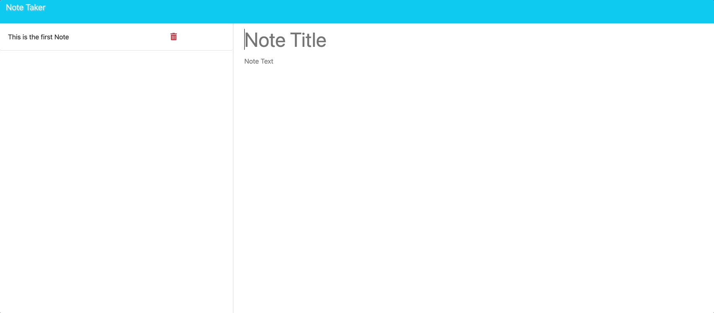
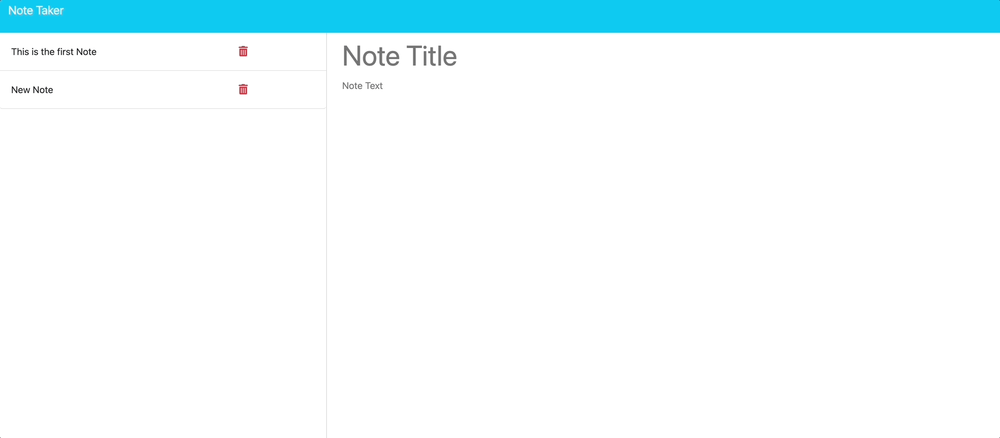

# Note_Taker_App

## Application to take notes digital

This application makes it easy to take notes digital and delete them afterwards.

## Table of Contents

- [Installation](#installation)
- [Usage](#usage)
- [Credits](#credits)
- [License](#license)
- [Badges](#badges)
- [Contributions](#contributions)
- [Questions](#questions)
- [Tests](#tests)

## Installation

Installation steps are as follows:
Download the application from my GitHub (link below).
Naviagate into the src folder.
From there run npm install to include all necessary dependencies.
After that run node server.js
You can deploy the application like this as well.
In case you run it local follow the localhost PORT 3001.
Application runs in a browser.

## Usage

The application takes you to a landing page. From there hit "Get Started".
The application takes you to the note taking page.
On the left side you see your open notes.
On the right side you can make a new note.
In case you want to see details of an open note click on it,
and the note will show on the right side.
When you want to delete a note after completion you can hit the "trash" icon.
To create a new note you can also select the "New Note" button on upper right side.
To save the note you apply the "Save Note" Button (also upper right).
To clear the note in case you made a mistake use the "Clear Form" Button (upper right as well).

## Credits

https://render.com, 
https://stackoverflow.com, 
https://expressjs.com

## License

https://opensource.org/license/mit

## Badges

## Contributions

Please approach me via email to see how we can collaborate

Link to deployed version:
https://note-taker-app-oq7k.onrender.com/

## Questions

Flo2009

https://github.com/Flo2009

supersuse81@gmail.com

## Tests

No test currently in this application

